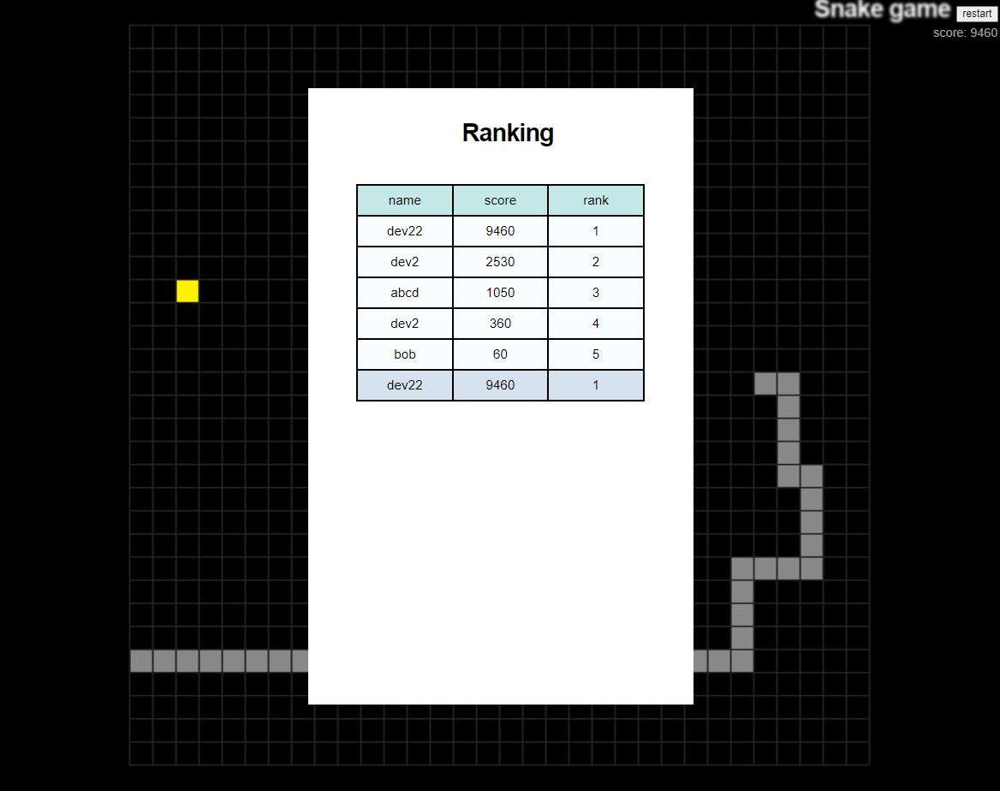

### SNAKE GAME

#### 1 게임 설명
- [뱀 게임](https://namu.wiki/w/%EB%B1%80%20%EA%B2%8C%EC%9E%84)을 구현함

 

#### 2 구현

##### 2.1 client단
- html + js + css
- [mdn web docs](https://developer.mozilla.org/ko/docs/Learn/Getting_started_with_the_web/JavaScript_basics)에서 학습한 내용들을 활용하여 개발함
- canvas 사용

##### 2.2 server단
- nodejs + express
- GET request 사용
- 어려웠던 점: 비동기 처리..

##### 2.3 db
- mysql 사용

- 게임 플레이가 끝날 때마다 db를 추가
- 상위 5등 이내 && 10인 이하의 순위를 가져와서 보여 줌
- 본인의 점수와 등수를 보여 줌